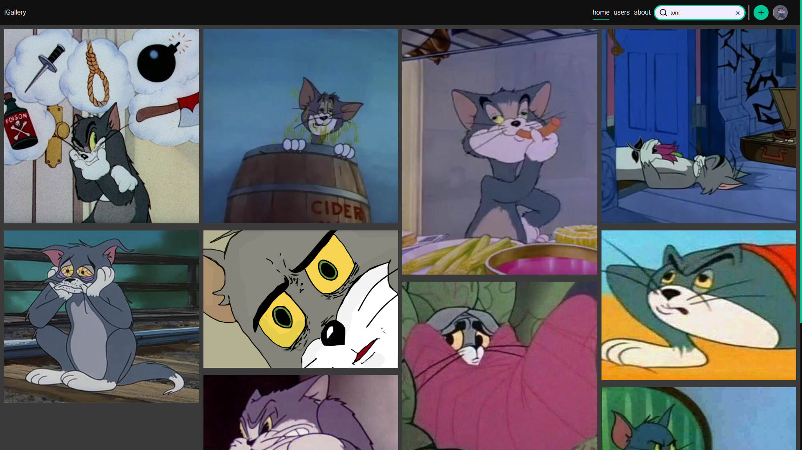
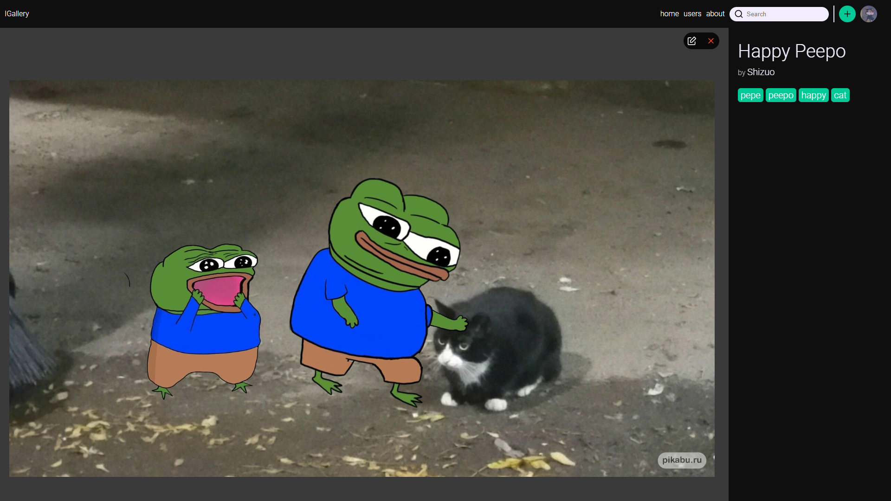
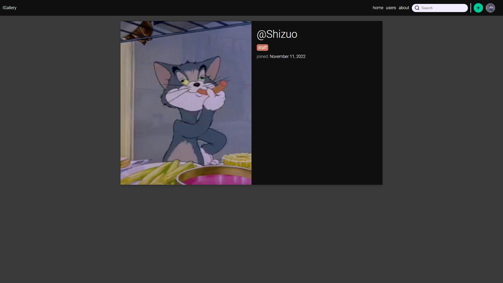
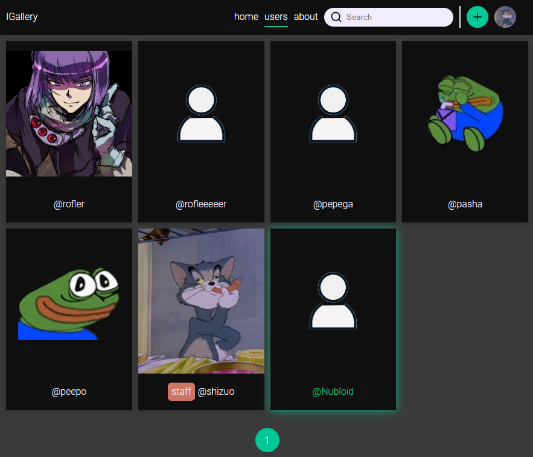
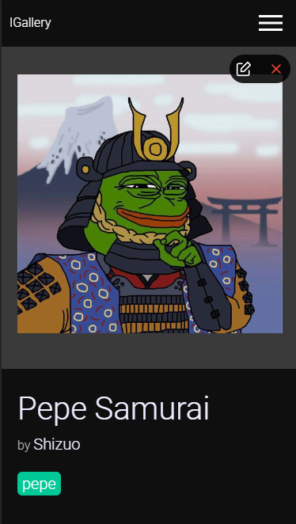
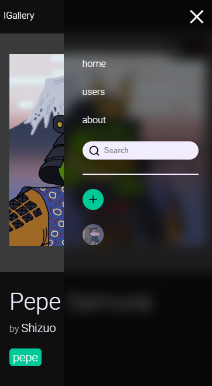

# Image gallery

Simple image gallery for storing images with tags

## Related

Here are some related projects

Backend part of project

[Backend image gallery](https://github.com/Persepha/image-gallery)


## Screenshots

Gallery



Gallery image


Image detail



User profile page



Users



Mobile image detail page






##  Built in
- React
- Redux
- React Router


## Environment Variables

To run this project, you will need to add the following environment variables to your .env file

`REACT_APP_AUTH_API_URL`

`REACT_APP_GALLERY_API_URL`

See sample .env file
## Run Locally

Clone the project

```bash
  git clone https://github.com/Persepha/image-gallery-frontend.git
```

Go to the project directory

```bash
  cd image-gallery-frontend
```

Install dependencies

```bash
  npm install
```

Start the backend server (see backend part documentation)

Start the frontend server

```bash
  npm start
```